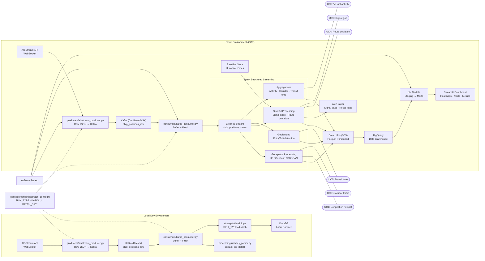

```mermaid
flowchart LR

subgraph LOCAL["Local Dev Environment"]
    direction TB
    A_LOCAL["AISStream API\nWebSocket"]
    PROD_LOCAL["producers/aisstream_producer.py\nRaw JSON → Kafka"]
    KAFKA_LOCAL["Kafka (Docker)\nship_positions_raw"]
    PARSER["processing/utils/ais_parser.py\nextract_ais_data()"]
    CONS_LOCAL["consumers/kafka_consumer.py\nBuffer + Flush"]
    SINK_LOCAL["storage/utils/sink.py\nSINK_TYPE=duckdb"]
    DUCK["DuckDB\nLocal Parquet"]
    A_LOCAL --> PROD_LOCAL --> KAFKA_LOCAL --> CONS_LOCAL
    CONS_LOCAL --> PARSER
    CONS_LOCAL --> SINK_LOCAL --> DUCK
end

subgraph CLOUD["Cloud Environment (GCP)"]
    direction TB
    A_CLOUD["AISStream API\nWebSocket"]
    PROD_CLOUD["producers/aisstream_producer.py\nRaw JSON → Kafka"]
    KAFKA_CLOUD["Kafka (Confluent/MSK)\nship_positions_raw"]
    CONS_CLOUD["consumers/kafka_consumer.py\nBuffer + Flush"]

    subgraph SPARK["Spark Structured Streaming"]
        direction TB
        SP_CLEAN["Cleaned Stream\nship_positions_clean"]
        SP_STATE["Stateful Processing\nSignal gaps · Route deviation"]
        SP_GEO["Geospatial Processing\nH3 / Geohash / DBSCAN"]
        SP_FENCE["Geofencing\nEntry/Exit detection"]
        SP_AGG["Aggregations\nActivity · Corridor · Transit time"]
    end

    GCS["Data Lake (GCS)\nParquet Partitioned"]
    BQ["BigQuery\nData Warehouse"]
    BASELINE["Baseline Store\nHistorical routes"]
    DBT["dbt Models\nStaging → Marts"]
    DASH["Streamlit Dashboard\nHeatmaps · Alerts · Metrics"]
    ALERTS["Alert Layer\nSignal gaps · Route flags"]

    A_CLOUD --> PROD_CLOUD --> KAFKA_CLOUD --> CONS_CLOUD --> SP_CLEAN
    SP_CLEAN --> SP_GEO
    SP_CLEAN --> SP_STATE
    SP_CLEAN --> SP_FENCE
    SP_CLEAN --> SP_AGG
    SP_GEO --> GCS
    SP_STATE --> GCS
    SP_FENCE --> GCS
    SP_AGG --> GCS
    GCS --> BQ --> DBT --> DASH
    SP_STATE --> ALERTS
    BASELINE --> SP_STATE
end

ORCH["Airflow / Prefect"]
ORCH --> PROD_CLOUD
ORCH --> CONS_CLOUD
ORCH --> DBT

CONFIG["ingestion/config/aisstream_config.py\nSINK_TYPE · KAFKA_* · BATCH_SIZE"]
CONFIG -.-> PROD_LOCAL
CONFIG -.-> PROD_CLOUD
CONFIG -.-> CONS_LOCAL
CONFIG -.-> CONS_CLOUD

UC1(["UC1: Congestion hotspot"])
UC2(["UC2: Vessel activity"])
UC3(["UC3: Corridor traffic"])
UC4(["UC4: Route deviation"])
UC5(["UC5: Transit time"])
UC6(["UC6: Signal gap"])

SP_GEO --- UC1
SP_AGG --- UC2
SP_GEO --- UC3
SP_STATE --- UC4
SP_FENCE --- UC5
SP_STATE --- UC6

```